<div align="center">
  

  # CFRSS

  **A self-hosted RSS reader that runs entirely on Cloudflare's free tier.**

  Four-column desktop reading, AI summaries and full-text translation, read-aloud,
  offline PWA — and every article archived in a GitHub repository you own.

  <sub>English · <a href="README.zh-CN.md">简体中文</a></sub>

  <br>

  [](https://deploy.workers.cloudflare.com/?url=https://github.com/ituff/cfrss)

  [](LICENSE)
  [](https://workers.cloudflare.com/)
  [](public/manifest.json)
</div>

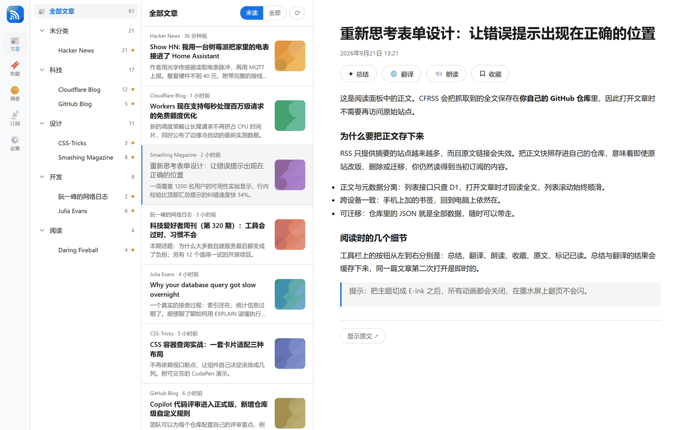

## What it is

CFRSS is an RSS reader for one person: you. You deploy it to your own Cloudflare
account, point it at the feeds you already read, and it quietly keeps them fresh
in the background. There is no sign-up, no shared server, no subscription fee —
the free tier of Cloudflare Workers is enough.

It is designed around a single idea: **your reading should not live on someone
else's computer.** The metadata sits in a database in your own account, and the
full text of every article is archived in a GitHub repository you control.

## What you get

- **📥 Feeds that keep themselves fresh** — an hourly job pulls every feed and
  files new articles as unread. Feeds that keep failing are flagged and skipped
  automatically, then quietly re-enabled once they respond again.
- **🗂 Categories and OPML** — group your feeds, move them between groups, and
  import or export a standard OPML file. Bringing your subscriptions over from
  another reader takes one click.
- **📖 Four-column desktop reading** — a feed tree with unread counts, a card
  list with thumbnails and infinite scroll, and a reader pane that gives the
  text room to breathe. Narrow the window and it becomes a single-column mobile
  layout on its own.
- **✦ Article summaries** — one click turns a long article into a short,
  structured digest. Results are cached, so the second visit is instant.
- **🌐 Full-text translation** — 10 target languages, and three ways to read the
  result: line-by-line alongside the original, side by side, or translation
  only. The original markup is preserved, so headings and lists survive.
- **🔊 Read-aloud** — paragraph-by-paragraph speech with the current paragraph
  highlighted as it goes, 19 curated neural voices, or automatic language
  detection per paragraph.
- **☀️ Daily digest** — a once-a-day roundup built from everything unread in the
  last 24 hours, with links back to each source.
- **🔖 Bookmarks** — save now, read later. Bookmarks follow you across devices.
- **📴 Offline PWA** — install it on your phone; the most recent 25 articles stay
  readable with no network at all.
- **🎨 Four themes** — Light, Dark, OLED pure black, and E-Ink (all animation
  disabled, so nothing flickers on an e-reader).
- **🌏 Bilingual interface** — Chinese and English, and the choice is remembered
  per device, so your e-reader and your laptop can disagree.
- **🗄 Articles archived** — the full text of every article is written to your
  own GitHub repository, so a feed that disappears takes nothing with it.

## A closer look

### Reading

The default view is unread-first: the feed tree shows where the unread articles
are, and the card list shows what they are — source, time, title, excerpt and a
thumbnail. Scroll and the next page loads by itself. Pick an article and it opens
beside the list, so you never lose your place.

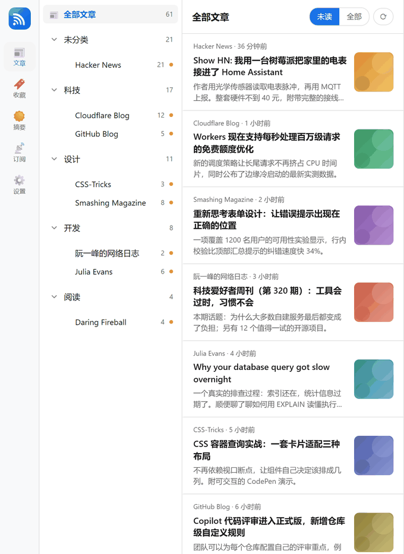

### Summaries and translation

Both are one click from the article toolbar. Summaries come back as clean
structured HTML; translations keep the original markup so the layout still reads
like an article. Everything is cached, and the target language and display mode
are remembered for next time.

| Summary | Translation (dual-line) |
| --- | --- |
| 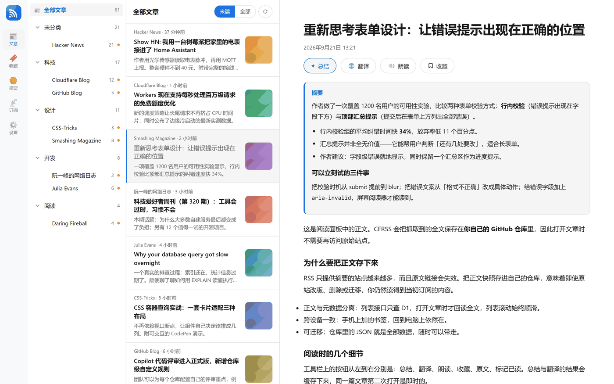 | 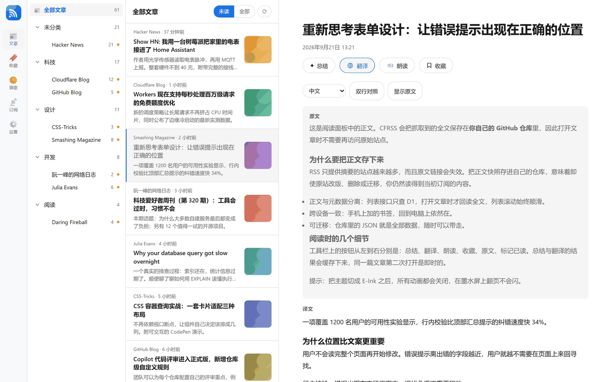 |

### Daily digest

A single page that answers "what happened while I was away", generated from the
last 24 hours of unread articles and linked back to each source.

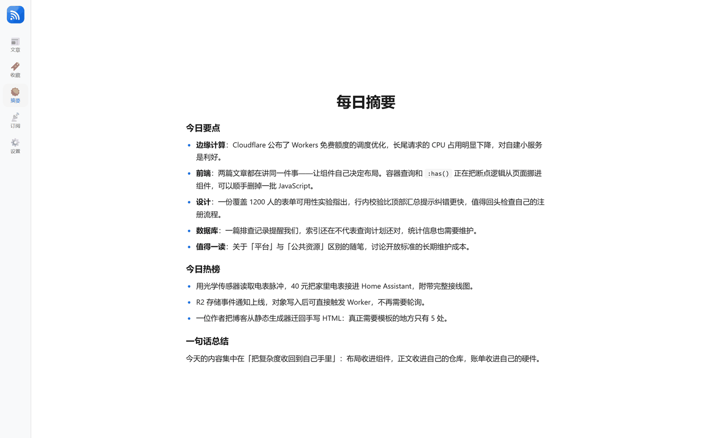

### Bookmarks and subscriptions

| Bookmarks | Subscriptions |
| --- | --- |
| 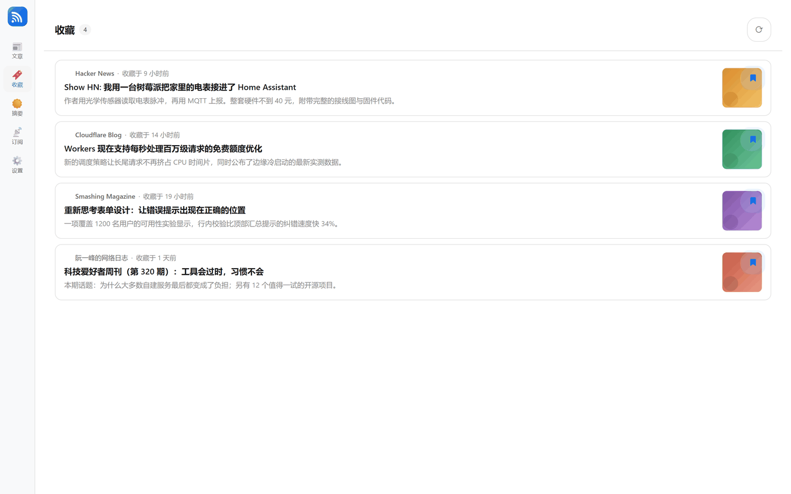 | 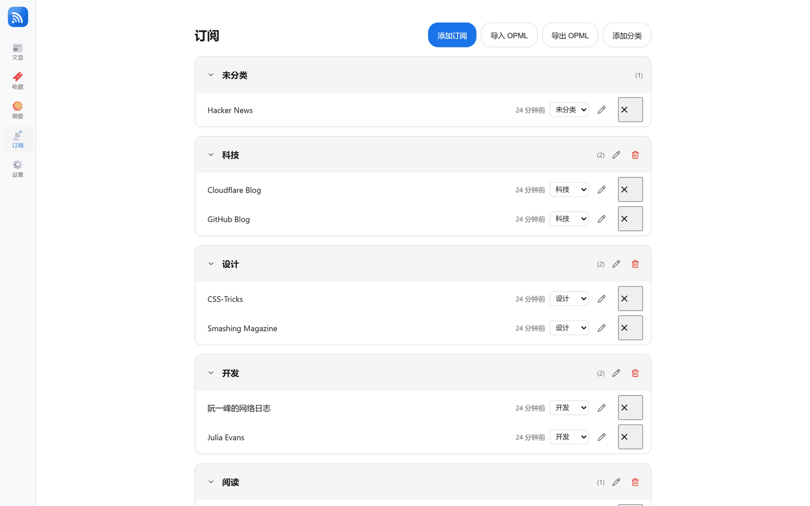 |

### Settings

Appearance, language, model providers, article storage and your access password
all live on one page. Secrets are encrypted before they are stored, and never
sent back to the browser in the clear.

| Appearance and AI | Article storage and password |
| --- | --- |
| 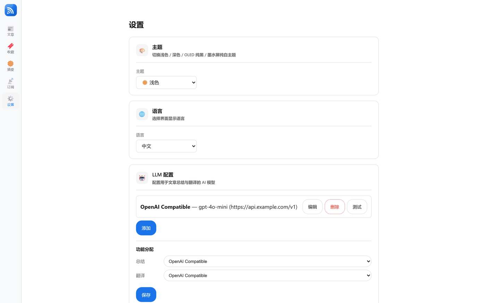 | 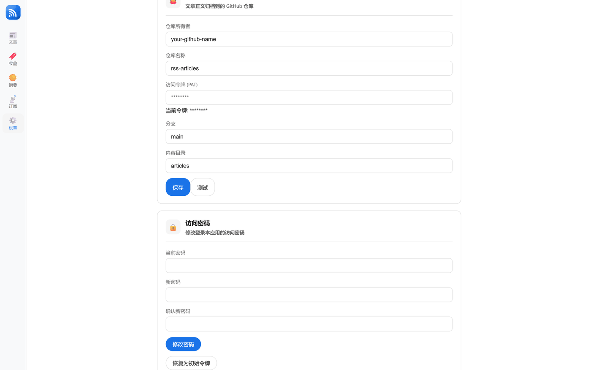 |

### Themes

Light · Dark · OLED · E-Ink. The last one is for e-readers: pure white, no
animations, no transitions.

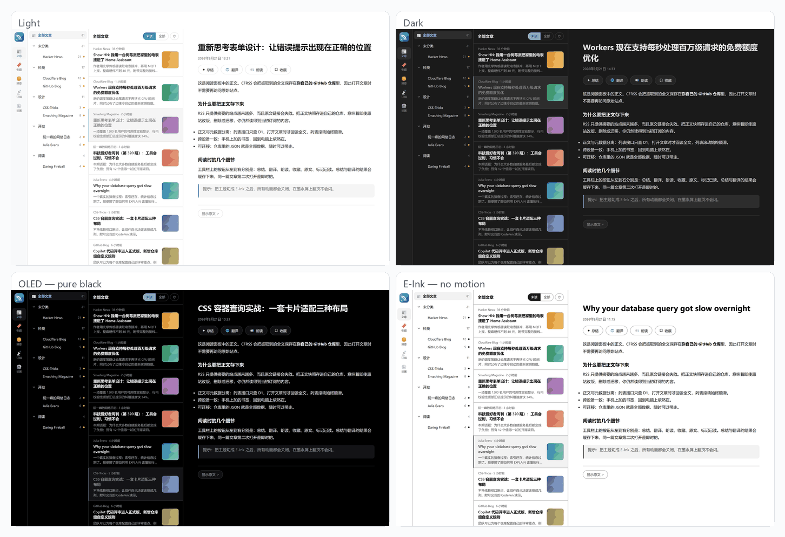

### On a phone

The layout switches by itself, and the whole app installs as a PWA.

| Article list | Reading | Dark |
| --- | --- | --- |
| 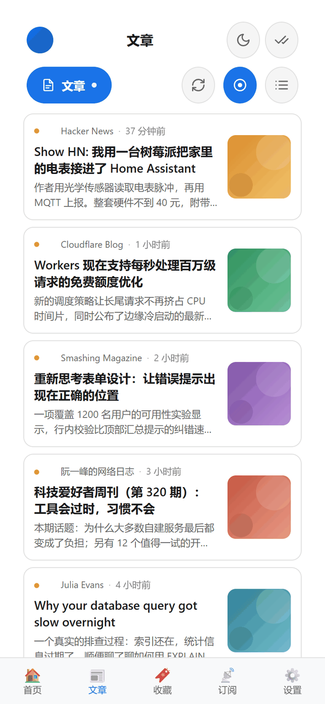 | 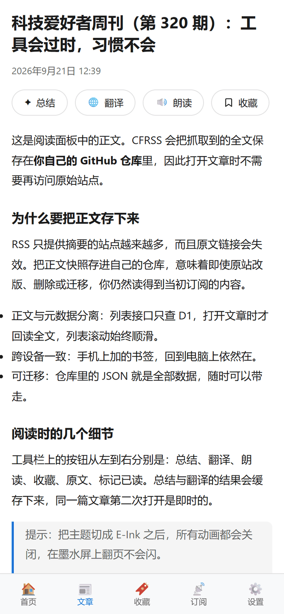 | 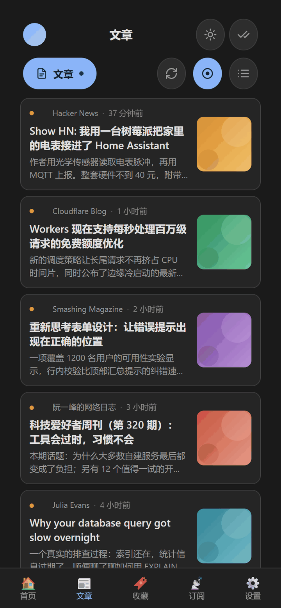 |

## Get it running

You need a Cloudflare account — the free plan is enough.

### One click

Hit the button at the top of this page. Cloudflare clones the repository into
your own account, creates the database, asks you for the two secrets, and
deploys. You get a working reader without touching a terminal.

### Manually

```bash
git clone https://github.com/ituff/cfrss.git
cd cfrss && npm install

npx wrangler d1 create cfrss-db          # paste the printed id into wrangler.toml
npx wrangler secret put AUTH_TOKEN       # the password you will sign in with
npx wrangler secret put ENCRYPTION_KEY   # any random string

npm run deploy                           # applies migrations, then deploys
```

Full walkthrough, including how to verify the deployment:
**[Manual deployment](docs/guides/manual-deployment.md)**.

### After it is up

Open the site, sign in with your `AUTH_TOKEN`, then finish setup in the settings
page:

1. **GitHub storage** — the repository, branch and a token with contents write
   access. This is where article full text is archived.
2. **AI provider** *(optional)* — any OpenAI-compatible endpoint, then assign it
   to summaries and translation. See
   **[Configure LLM](docs/guides/llm-configuration.md)**.
3. **Read-aloud** *(optional)* — the URL and key of a read-aloud deployment. See
   **[Configure read-aloud](docs/guides/read-aloud.md)**.
4. **Subscriptions** — import an OPML file or add feeds one by one. The first
   refresh starts pulling immediately; after that, the hourly job takes over.

## Good to know

**Does it cost anything?**
It is built to stay inside Cloudflare's free plan. The hourly refresh works
through your feeds in small batches so a single run stays well under the free
tier's CPU budget — with a lot of feeds, a full cycle simply takes a few hours
instead of one.

**Do I have to connect GitHub?**
No. Without it, articles show whatever the feed itself provides. Connecting a
repository is what unlocks full-text reading, translation of the whole article
and offline caching.

**Which AI models work?**
Anything that speaks the OpenAI chat-completions API. You can store several
providers and assign different ones to summaries and translation.

**Can my family use it?**
Not currently — it is deliberately single-user. One instance, one reader.

**What happens when a feed dies?**
It is retried for a few days, then flagged as abnormal and skipped so it stops
slowing down every refresh. The subscription list shows a warning marker, and one
click re-enables it.

## Documentation

Everything sits under [`docs/`](docs/README.md) — start at the
**[documentation index](docs/README.md)**. The three guides, each in English and
Simplified Chinese:

| Guide | English | 中文 |
|---|---|---|
| Deploy it by hand | [Manual deployment](docs/guides/manual-deployment.md) | [手动部署](docs/guides/manual-deployment.zh-CN.md) |
| Wire up an AI provider | [Configure LLM](docs/guides/llm-configuration.md) | [配置 LLM](docs/guides/llm-configuration.zh-CN.md) |
| Set up read-aloud (TTS) | [Configure read-aloud](docs/guides/read-aloud.md) | [配置朗读服务](docs/guides/read-aloud.zh-CN.md) |

## License

[GPL-3.0](LICENSE).

## Follow along

Project updates and reading notes go to my WeChat official account — scan if you
read Chinese.


