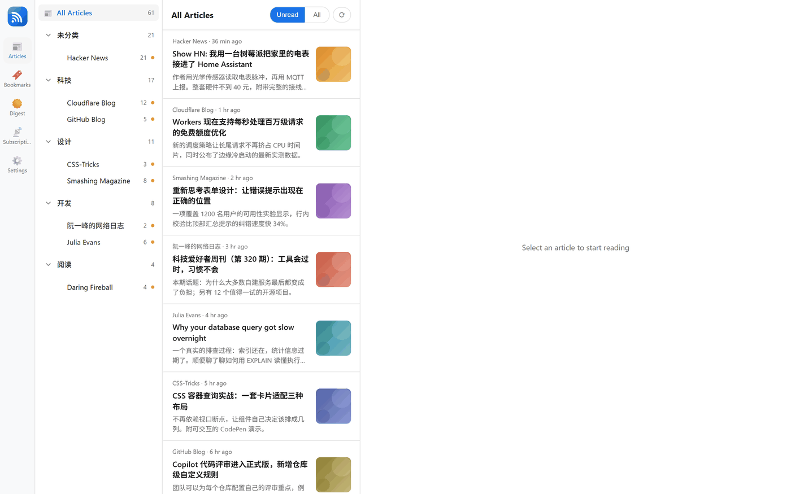

<div align="center">
  

  # CFRSS

  **完全跑在 Cloudflare 免费额度上的自托管 RSS 阅读器。**

  桌面四栏阅读、AI 总结与全文翻译、网页朗读、离线 PWA —— 每篇文章的正文
  都归档在你自己拥有的 GitHub 仓库里。

  <sub><a href="README.md">English</a> · 简体中文</sub>

  <br>

  [](https://deploy.workers.cloudflare.com/?url=https://github.com/ituff/cfrss)

  [](LICENSE)
  [](https://workers.cloudflare.com/)
  [](public/manifest.json)
</div>


## 这是什么

CFRSS 是一个**只给你一个人用**的 RSS 阅读器。把它部署到你自己的 Cloudflare
账号，填上你本来就在读的订阅源，它就会在后台默默帮你保持更新。没有注册、没有
共用服务器、没有订阅费 —— Cloudflare Workers 的免费额度就够了。

整个项目只围绕一个想法：**你的阅读不应该住在别人的电脑上。** 元数据存在你自己
账号的数据库里，每篇文章的正文归档到你自己控制的 GitHub 仓库。

## 它能做什么

- **📥 自动保持新鲜的订阅** —— 每小时定时抓取一次，新文章以未读状态出现。连续
  失败的源会被自动标记并跳过，等它恢复正常后又悄悄重新启用。
- **🗂 分类与 OPML** —— 给订阅源分组、在分组之间移动，导入导出标准 OPML 文件。
  从别的阅读器搬家只需要一次点击。
- **📖 桌面四栏阅读** —— 左侧订阅树带未读数，中间是带缩略图、无限滚动的卡片
  列表，右侧阅读面板给正文留足空间。把窗口拉窄，它会自动变成单栏移动端布局。
- **✦ 文章总结** —— 一键把长文压成结构清晰的短摘要，结果会缓存，第二次打开是
  瞬时的。
- **🌐 全文翻译** —— 支持 10 种目标语言，三种阅读方式：逐段双行对照、左右并排、
  只看译文。原文的标签结构会被保留，标题和列表不会散架。
- **🔊 网页朗读** —— 逐段合成语音，读到哪段高亮哪段；内置 19 个精选神经音色，
  也可以按段落语言自动选声。
- **☀️ 每日摘要** —— 每天一页，把过去 24 小时的未读文章汇总成要点，每条都附上
  原文链接。
- **🔖 收藏** —— 先存下，回头再读；收藏状态跨设备同步。
- **📴 离线 PWA** —— 装到手机上之后，最近 25 篇文章在完全没有网络时也能读。
- **🎨 四套主题** —— 浅色、深色、OLED 纯黑、墨水屏纯白（关闭全部动画，在电子
  阅读器上翻页不会闪）。
- **🌏 中英双语界面** —— 语言偏好按设备记忆，你的墨水屏和笔记本可以各用一套。
- **🗄 正文归档** —— 每篇文章的全文都会写进你自己的 GitHub 仓库，订阅源哪天消失
  了也不会带走任何东西。

## 细节一览

### 阅读

默认只显示未读：左侧订阅树告诉你未读集中在哪，中间卡片列表告诉你它们是什么 ——
来源、时间、标题、摘要和缩略图。列表滚到底会自动加载下一页；点开文章就在列表右侧
展开，位置不会丢。


### 总结与翻译

都在文章工具栏上，一次点击。总结返回干净的结构化 HTML；翻译保留原有标签结构，
排版读起来仍然像一篇文章。两者都会缓存，目标语言和显示方式也会记住。

| 文章总结 | 翻译（双行对照） |
| --- | --- |
|  |  |

### 每日摘要

一页回答「我不在的时候发生了什么」，内容来自过去 24 小时的未读文章，每条都带
原文链接。


### 收藏与订阅管理

| 收藏 | 订阅管理 |
| --- | --- |
|  |  |

### 设置

外观、语言、模型服务商、正文存储、访问密码都在同一页。密钥落库前会加密，永远
不会以明文回传到浏览器。

| 外观与 AI | 正文存储与密码 |
| --- | --- |
|  |  |

### 四套主题

浅色 · 深色 · OLED · 墨水屏。最后一套是给电子阅读器准备的：纯白、无动画、无过渡。


### 手机上

布局自动切换，整个应用可以装成 PWA。

| 文章列表 | 阅读 | 深色 |
| --- | --- | --- |
|  |  |  |

### 英文界面

界面已完整翻译 —— 同一个应用，换一种语言，按设备记住选择。



## 跑起来

你需要一个 Cloudflare 账号，免费版就够。

### 一键部署

点页面顶部的按钮。Cloudflare 会把仓库复制到你自己的账号下、建好数据库、向你
索取两个密钥，然后完成部署。不用碰命令行，就能得到一个可用的阅读器。

### 手动部署

```bash
git clone https://github.com/ituff/cfrss.git
cd cfrss && npm install

npx wrangler d1 create cfrss-db          # 把输出的 id 填进 wrangler.toml
npx wrangler secret put AUTH_TOKEN       # 你将来用来登录的密码
npx wrangler secret put ENCRYPTION_KEY   # 任意随机字符串

npm run deploy                           # 先应用数据库迁移，再部署
```

完整步骤（含如何验证部署结果）见
**[手动部署指南](docs/guides/manual-deployment.zh-CN.md)**。

### 部署之后

打开站点，用 `AUTH_TOKEN` 登录，在设置页完成剩下的配置：

1. **GitHub 存储** —— 仓库、分支，以及一个有 contents 写权限的 token。正文会
   归档到这里。
2. **AI 服务商**（可选）—— 任何 OpenAI 兼容的接口，然后把它分配给总结和翻译。
   详见 **[配置 LLM](docs/guides/llm-configuration.zh-CN.md)**。
3. **朗读**（可选）—— 一个 read-aloud 部署的地址和密钥。详见
   **[配置朗读服务](docs/guides/read-aloud.zh-CN.md)**。
4. **订阅** —— 导入 OPML 文件，或一个个添加订阅源。第一次刷新会立刻抓取，之后
   交给每小时的定时任务。

## 常见问题

**要花钱吗？**
整个项目是按免费额度设计的。每小时刷新会刻意把订阅源分成小批次处理，让单次运行
远低于免费版的 CPU 限制 —— 订阅源很多时，一整轮只是会花上几个小时，而不是一次
跑完。

**必须接 GitHub 吗？**
不是必须。不接的话，文章只显示订阅源自己提供的内容。接上仓库之后，才有全文阅读、
全文翻译和离线缓存。

**支持哪些 AI 模型？**
任何兼容 OpenAI chat-completions 接口的服务。你可以存多个服务商，并分别指定给
总结和翻译。

**家里人能一起用吗？**
暂时不行 —— 它是刻意做成单用户的。一个实例，一个读者。

**订阅源挂了会怎样？**
会被重试几天，然后标记为异常并跳过，不再拖慢每次刷新。订阅列表里会显示警告标记，
点一下就能重新启用。

## 文档

全部放在 [`docs/`](docs/README.md) 下，入口是 **[文档索引](docs/README.md)**。
三篇指南各有中英两版：

| 指南 | 中文 | English |
|---|---|---|
| 手动部署 | [手动部署](docs/guides/manual-deployment.zh-CN.md) | [Manual deployment](docs/guides/manual-deployment.md) |
| 接入 AI 服务商 | [配置 LLM](docs/guides/llm-configuration.zh-CN.md) | [Configure LLM](docs/guides/llm-configuration.md) |
| 配置朗读（TTS） | [配置朗读服务](docs/guides/read-aloud.zh-CN.md) | [Configure read-aloud](docs/guides/read-aloud.md) |

## 许可

[GPL-3.0](LICENSE)。

## 关注公众号

项目的更新与使用笔记会发在公众号上，欢迎扫码：


